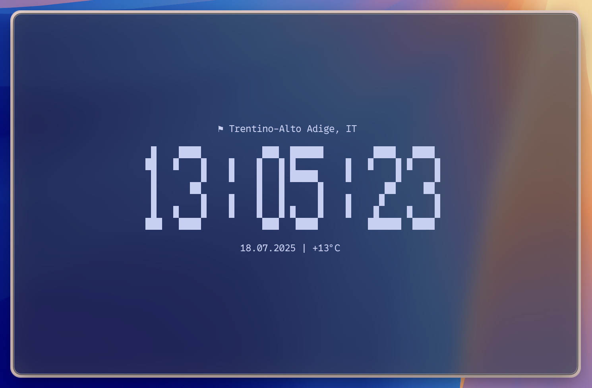
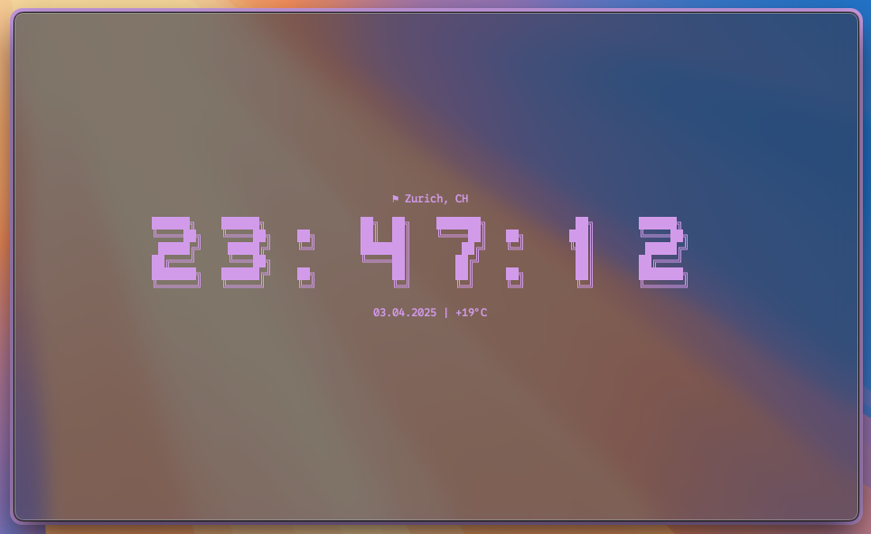
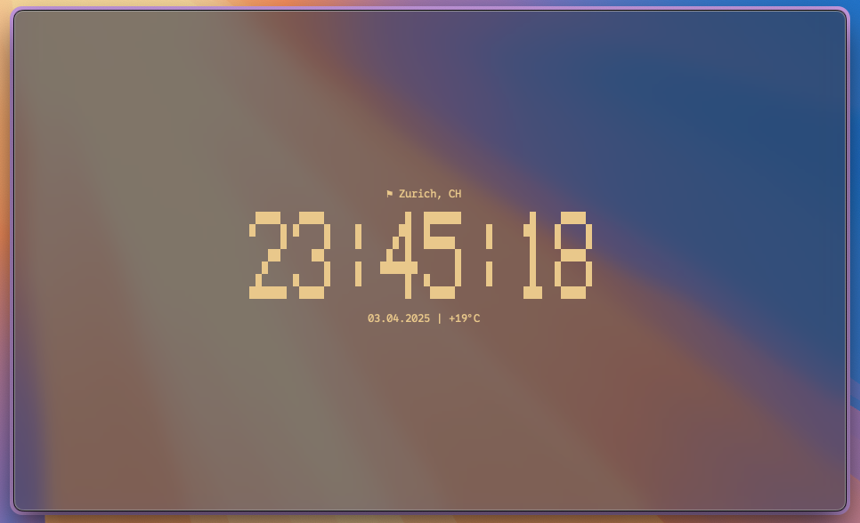
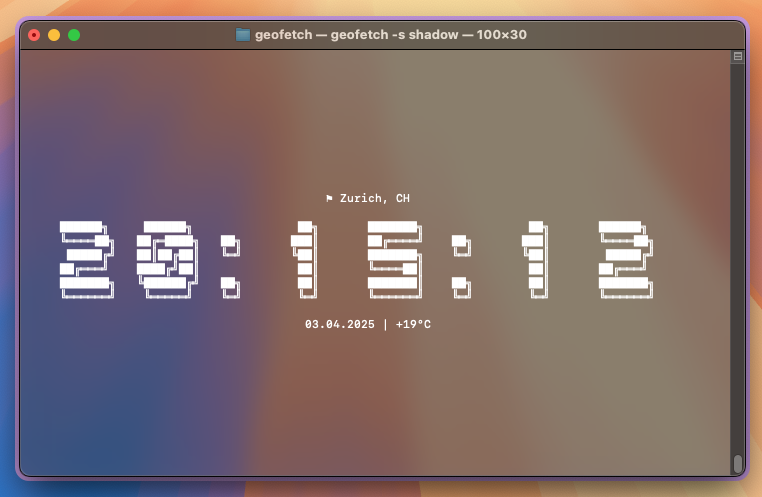

# 🛰️ geofetch

`geofetch` is a modern and minimalistic terminal clock with geo-based enhancements.  
It displays a **large, customizable clock**, your **current location**, **date**, and **temperature**, all perfectly centered in your terminal window – with style.

---





## ✨ Features

- Live updating terminal clock
- Fancy font styles and color customization
- Real-time location (region + country)
- Date and temperature display
- Keyboard-controlled (`q` or `ESC` to quit)
- Clean fullscreen UI with centered layout

---

## 📦 Installation

- You can compile and install `geofetch` locally using the provided `Makefile`:

```bash
make
sudo make install
```
The binary will be installed to /usr/local/bin/geofetch by default


- To remove:
```bash
sudo make uninstall
```
### Further options:
To run without installing:
```bash
make run
```
Just create a binary:
```bash
make
```

## 🚀 Usage
```bash
geofetch                 # Default font and color
geofetch -s slim        # Choose font style (see below)
geofetch -c cyan        # Choose text color
geofetch help           # Show help
geofetch style          # Show available font styles
```
Available styles and colors:
- Fonts: block, slim, shadow, soft, neo
- Colors: red, green, yellow, blue, magenta, cyan, white

## ⚠️ Platform Support
Currently tested on macOS and Linux only

## 🚧 Status
geofetch is under active development
